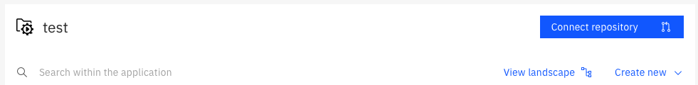
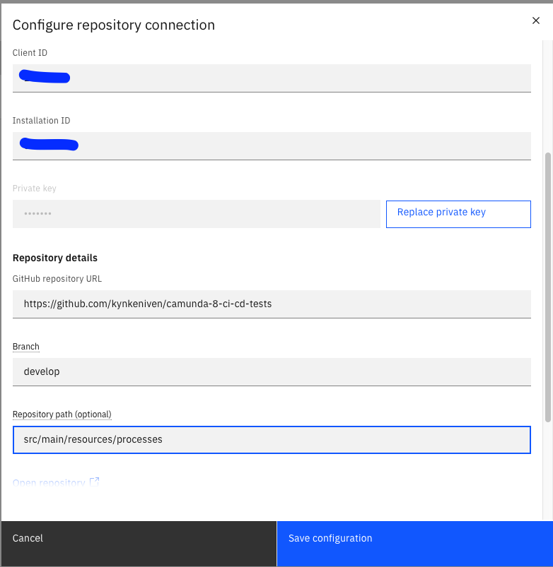
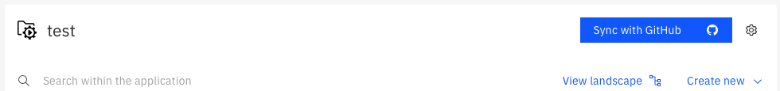
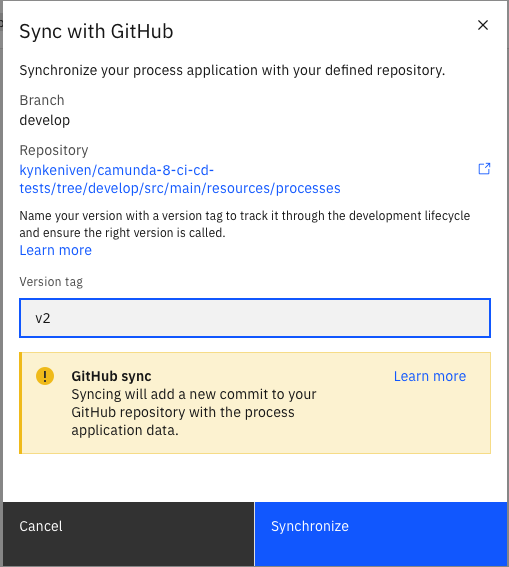
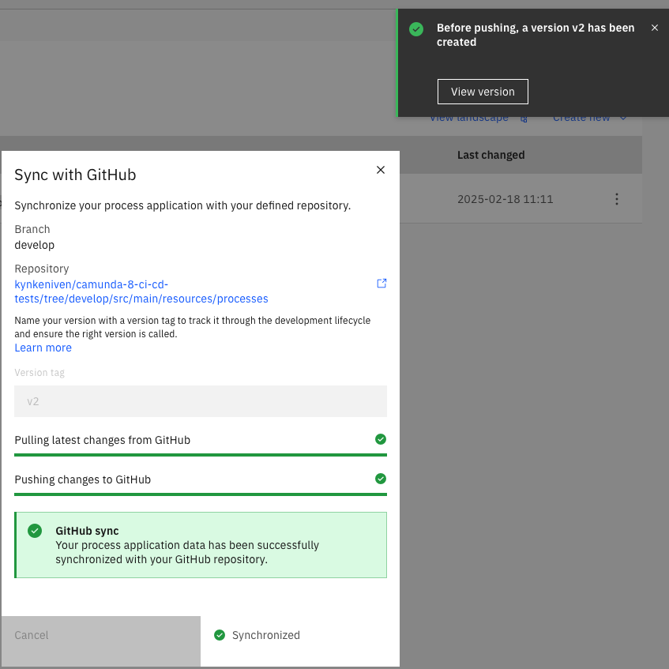
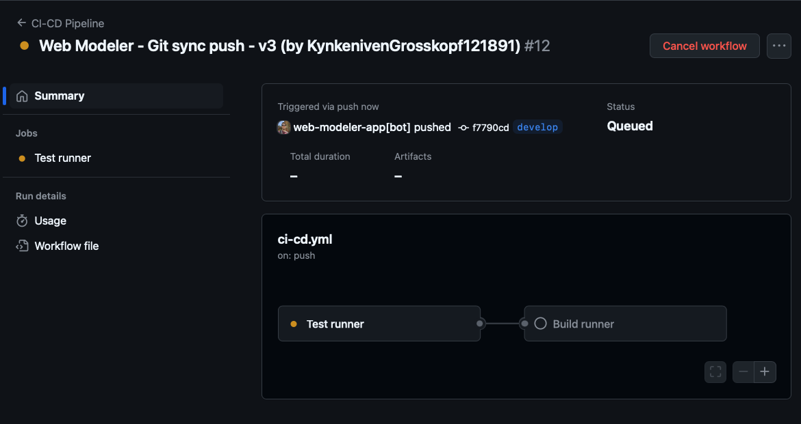

# Camunda 8 CI/CD and Tests

This PoC demonstrates how to integrate your Web Modeler with a GitHub repository, triggering the CI/CD pipeline to run BPMN tests and deploy the diagrams to your cluster.

1. At your Project folder in WebModeler create a new `Process Application`
  

2. Create a Github App at your Github account. Follow the steps below
`https://docs.camunda.io/docs/next/components/modeler/web-modeler/git-sync/`
3. Also follow the steps in the link above to Sync your `Process Application` to your Github repository

Button to connect your Git repository

Example how to setup the button

After GitSync setup

When you click GitSync button you need to create a new version of your diagrams

After sync

Check your pipeline, Tests will be ran and your diagrams will be deployed in the cluster

6. Don't forget to add your Camunda cluster credentials at
`src/main/resources/application.yaml`
7. The process used in this example is located here:
`src/main/resources/processes/process-example.bpmn`
8. The Tests are located in this folder:
`src/test/java/com/example/camunda`

## Tests

- Currently using Zeebe Process Test (ZPT) for tests, a stable test library for Camunda 8.6
`https://docs.camunda.io/docs/apis-tools/java-client/zeebe-process-test/#zeebe-spring-sdk-integration`

- Test examples for ZPT
`https://github.com/camunda-community-hub/camunda-8-examples/blob/main/twitter-review-java-springboot/src/test/java/org/camunda/community/examples/twitter/TestTwitterProcess.java`

- Camunda 8.7 or higher will release a stable version of Camunda Process Test (CPT). This is the new test library from Camunda, it is based on JUnit5 and Testcontainers
`https://docs.camunda.io/docs/apis-tools/testing/getting-started/`
- Test examples for CPT
`https://github.com/camunda/camunda/tree/main/testing/camunda-process-test-example`

